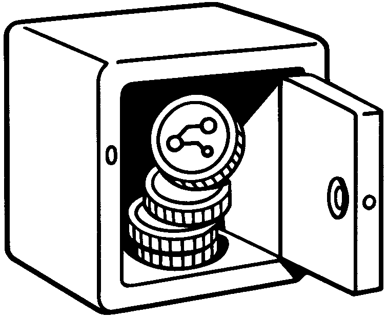

# Rendex

## Introduction

This project serves as the final submission for the "EVM Chain Certification" program offered by Alchemy University. The investment use case presented herein was selected as the capstone project due to its foundational simplicity, which provides a clear and accessible framework for demonstrating core blockchain development principles. However, the implementation introduces several nuanced complexities, particularly in the integration of an off-chain oracle mechanism that bridges traditional financial data sources with on-chain smart contract execution. The comprehensive investment lifecycle—encompassing tokenization, yield accrual through rebasing mechanisms, and redemption processes—offers a holistic opportunity to synthesize and apply the diverse technical competencies acquired throughout the certification curriculum.

## Project Description

**Rendex** is a simple Web3 simulation of an investment flow using a rebasing ERC-20 token. It mimics how users earn yield on invested funds, with returns based on a post-fixed rate tied to **CDI**, a Brazilian benchmark interest rate used in fixed-income financial products. The token balance grows daily through smart contract-controlled rebases, using an oracle-fed CDI value to simulate on-chain yield.

> ⚖️ **Regulatory Notice**
>
> The modeled asset in this project I understand behaves economically as an investment product and would likely be characterized as a **security** under Brazilian regulation.  
> In a real market implementation, a yield-bearing tokenized deposit would not function as a stablecoin, but rather as a financial investment whose return is tied to the performance of underlying assets.  
> As such, it would be subject to Brazilian taxes applicable to investments, including **Imposto de Renda (IR)** and **IOF**, depending on the final structure adopted.


## Investment Journey Overview

This section provides a simplified, high-level view of how an investment moves from fiat deposit to on-chain value creation and final redemption.

<table>
<tr>
<td></td>
<td><strong>Depositing fiat</strong><br>The investor begins by depositing fiat currency into the platform. This deposit is held by the financial institution or on/off-ramp partner before entering the tokenization flow.</td>
</tr>
<tr>
<td></td>
<td><strong>Obtaining tokenized deposit</strong><br>The fiat deposit is converted into a digital representation known as a tokenized deposit. This on-chain token reflects the investor's claim to the underlying real-world funds.</td>
</tr>
<tr>
<td></td>
<td><strong>Investment pool</strong><br>The investor's tokenized deposit is transferred into the investment pool smart contract. In exchange, the investor receives pool tokens representing their proportional share of the pool.</td>
</tr>
<tr>
<td></td>
<td><strong>Pool value increases</strong><br>As the underlying assets generate yield, the pool's unit price increases over time. The oracle feeds updated pricing and performance data to the smart contract, ensuring accurate valuation.</td>
</tr>
<tr>
<td></td>
<td><strong>Redeeming token</strong><br>The investor converts their tokenized deposit back into fiat currency through the off-ramp partner. Finally, the funds are transferred back to the investor's traditional bank account.</td>
</tr>
</table>

---

> **Note:** In a real-world implementation, the investor would begin by depositing fiat, which is then converted into a tokenized deposit by a licensed financial institution.  
> This project does **not** cover the fiat-to-token conversion process and starts from the point where the ERC-20 tokenized deposit already exists on-chain.

---

## 🔍 Overview

- **Token Type:** Rebasing ERC-20
- **Yield Rate:** 120% of CDI (daily rebase, compounded from monthly CDI)
- **Custody:** Off-chain (abstracted in the simulation)
- **Chain:** Sepolia (testnet)
- **Purpose:** Educational / Proof-of-Concept

---

## 💻 Tech Stack

| Layer           | Technology                  | Purpose                            |
|----------------|------------------------------|------------------------------------|
| Framework       | Next.js (TypeScript)         | Routing + SSR + scalability        |
| Wallet Connect  | RainbowKit + Wagmi           | MetaMask and WalletConnect support |
| Blockchain SDK  | Alchemy SDK                   | Contract calls + enhanced features |
| Styling         | Tailwind CSS                 | Fast UI development                |
| Provider        | Alchemy                      | RPC + observability + testnet/mainnet |
| Chain           | Sepolia                      | Testnet for MVP                    |

---

## 🧱 Architecture

### Smart Contracts

- `RendexToken`: ERC-20 token with `rebase()` function and CDI oracle integration
- `CDIOracle`: Oracle contract for CDI rate data

### Off-Chain Components

- **CDI Oracle Service**: A Node.js service that fetches the current CDI from the [Brazilian Central Bank API](https://api.bcb.gov.br/dados/serie/bcdata.sgs.12/dados/ultimos/1?formato=json) and updates the on-chain oracle once per day. The monthly CDI rate is converted to a daily compound rate using the formula: `daily_rate = (1 + monthly_cdi)^(1/30) - 1`.
- **Rebaser**: A cronjob or script that calls `updateCDI()` and triggers `rebase()` daily to maintain the yield simulation.

### Diagrams

- **Sequence Diagrams**: See [docs/sequence-diagram.md](docs/sequence-diagram.md) for detailed Mermaid sequence diagrams illustrating system interactions, oracle updates, rebase execution, and user flows.
- **Class Diagrams**: See [docs/UML-Class-Diagram.md](docs/UML-Class-Diagram.md) for contract structure diagrams.

---

## 🧪 MVP Features

- ✅ Connect wallet using MetaMask or WalletConnect
- ✅ View current token balance (auto-increasing via rebase)
- ✅ Admin-only button to trigger `rebase()`
- ✅ Display the current CDI rate from the on-chain oracle

---

## 📂 Folder Structure

```
/frontend
├── /components       # UI components like WalletConnect, TokenPanel
├── /lib              # wagmi setup, ABI files, constants
├── /pages            # Next.js pages
├── /styles           # Tailwind CSS
├── .env.local        # Alchemy key (not committed)
├── README.md
```

---

## 🚀 Getting Started

### Option 1: Docker (Recommended)

1. Clone the repo
2. Start development environment:

```bash
# Using Makefile (recommended)
make up-dev

# Or using Docker Compose directly
docker-compose up -d frontend-dev
```

3. Access the application at http://localhost:3001

4. View logs:
```bash
make logs-frontend-dev
```

### Option 2: Local Development

1. Clone the repo
2. Install dependencies:

```bash
npm install
```

3. Add your Alchemy key to `.env.local`

4. Run the dev server:

```bash
npm run dev
```

### Docker Commands

```bash
# Show all available Docker commands
make help

# Development
make up-dev         # Start development environment
make build-dev      # Build development image
make logs-frontend-dev  # View logs

# Oracle Service
make up-oracle      # Start oracle service only
make oracle-logs    # View oracle service logs
make oracle-manual  # Trigger manual CDI update
make oracle-status  # Check oracle service status

# Production
make build          # Build production image
make up             # Start production environment
make deploy-prod    # Deploy to production

# Maintenance
make down           # Stop all services
make clean          # Clean up containers and images
```

For detailed Docker documentation, see [README-Docker.md](README-Docker.md).

### Oracle Service Setup

The CDI Oracle Service is included in the Docker setup and will automatically start with the development environment. To configure it:

1. **Set environment variables** in your `.env` file:
```bash
RPC_URL=https://sepolia.infura.io/v3/YOUR_INFURA_KEY
ORACLE_PRIVATE_KEY=your_private_key_here
CDI_ORACLE_ADDRESS=0x... # Address of deployed CDI Oracle contract
```

2. **Start the oracle service**:
```bash
make up-oracle
```

3. **Monitor the service**:
```bash
make oracle-logs
```

For detailed oracle service documentation, see [oracle-service/README.md](oracle-service/README.md).

---

## 🧪 Testing

```bash
# Run contract tests
npm run test

# Run frontend tests
npm run test:frontend
```

---

## 🚀 Deployment

```bash
# Deploy to Sepolia testnet
npm run deploy:sepolia

# Verify contracts on Etherscan
npm run verify:sepolia
```

---

## 🔧 API Integration

The CDI rate is fetched from the Brazilian Central Bank API:

- **Latest Rate:** `https://api.bcb.gov.br/dados/serie/bcdata.sgs.12/dados/ultimos/1?formato=json`
- **Historical Data:** `https://api.bcb.gov.br/dados/serie/bcdata.sgs.12/dados?formato=json&dataInicial=DD/MM/AAAA&dataFinal=DD/MM/AAAA`

The monthly CDI rate is converted to daily compound rate: `daily_rate = (1 + monthly_cdi)^(1/30) - 1`

---

## 👨‍💼 Admin Functions

- `updateCDI(uint256 newRate)`: Update the CDI rate (admin only)
- `rebase()`: Trigger daily rebase (admin only)
- `setAdmin(address newAdmin)`: Transfer admin role (admin only)

---

## 📜 License

MIT (for code), simulation only — no real funds involved.
