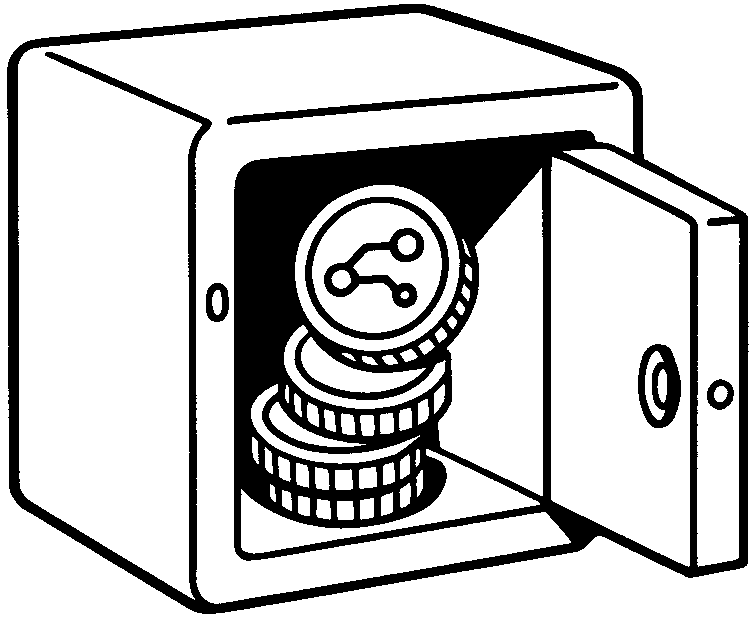
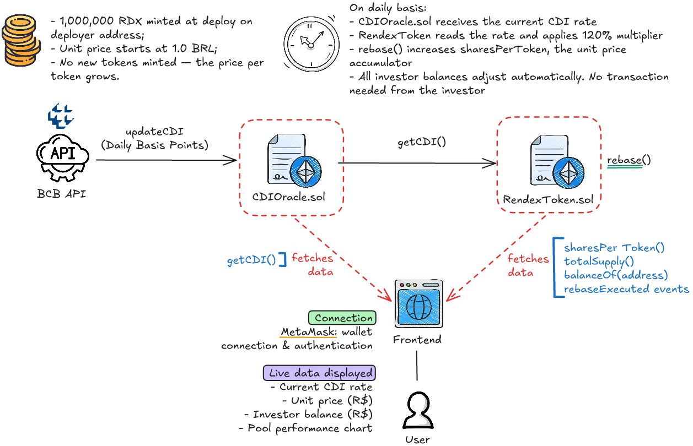
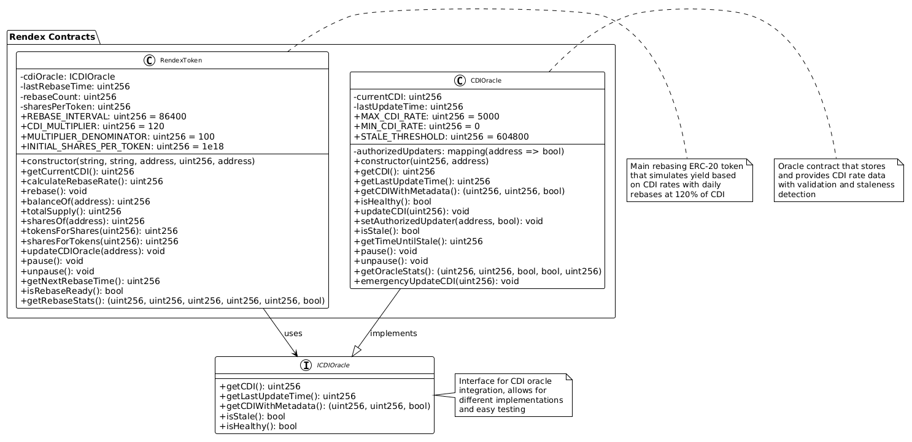

# Rendex

## Introduction

This project serves as the final submission for the "EVM Chain Certification" progoram offered by Alchemy University. The investment use case presented herein was selected as the Capstone Project due to its foundational simplicity, which provides a clear and accessible framework for demonstrating core blockchain development principles. However, the implementation introduces several nuanced complexities, particularly in the integration of an off-chain oracle mechanism that bridges traditional financial data sources with on-chain smart contract execution. The comprehensive investment lifecycle—encompassing tokenization, yield accrual through rebasing mechanisms, and redemption processes offers a holistic opportunity to synthesize and apply the diverse technical competencies acquired throughout the certification curriculum.

## Project Description

<p align="center">
  
</p>


<b>Rendex</b> is a simple Web3 simulation of an investment flow using a rebasing ERC-20 token (RDX). It mimics how users earn yield on invested funds, with returns based on a post-fixed rate tied to <b>CDI</b>, a Brazilian benchmark interest rate used in fixed-income financial products. The token balance grows daily through smart contract-controlled rebases, using an oracle-fed CDI value to simulate on-chain yield.


> ⚖️ **Regulatory Notice**
>
> The modeled asset in this project I understand behaves economically as an investment product and would likely be characterized as a **security** under Brazilian regulation.  
> In a real market implementation, a yield-bearing tokenized deposit would not function as a stablecoin, but rather as a financial investment whose return is tied to the performance of underlying assets.  
> As such, it would be subject to Brazilian taxes applicable to investments, including **Imposto de Renda (IR)** and **IOF**, depending on the final structure adopted (assuming that it is being launched in Brazil).


## Investment Journey Overview

This section provides a simplified, high-level view of how an investment moves from fiat deposit to on-chain value creation and final redemption.

<table>
<tr>
<td></td>
<td><strong>Depositing fiat</strong><br>The investor begins by depositing fiat currency into the platform. This deposit is held by the financial institution or on/off-ramp partner before entering the tokenization flow.</td>
</tr>
<tr>
<td></td>
<td><strong>Obtaining tokenized deposit</strong><br>The fiat deposit is converted into a digital representation known as a tokenized deposit. This on-chain token reflects the investor's claim to the underlying real-world funds.</td>
</tr>
<tr>
<td></td>
<td><strong>Investment pool</strong><br>The investor's tokenized deposit is transferred into the investment pool smart contract. In exchange, the investor receives pool tokens representing their proportional share of the pool.</td>
</tr>
<tr>
<td></td>
<td><strong>Pool value increases</strong><br>As the underlying assets generate yield, the pool's unit price increases over time. The oracle feeds updated pricing and performance data to the smart contract, ensuring accurate valuation.</td>
</tr>
<tr>
<td></td>
<td><strong>Redeeming token</strong><br>The investor converts their tokenized deposit back into fiat currency through the off-ramp partner. Finally, the funds are transferred back to the investor's traditional bank account.</td>
</tr>
</table>

---

> **Note:** In a real-world implementation, the investor would begin by depositing fiat, which is then converted into a tokenized deposit by a licensed financial institution.  
> This project does **not** cover the fiat-to-token (on-ramp) conversion process and starts from the point where the ERC-20 tokenized deposit already exists on-chain.

---

## 🔍 Overview

- **Token Type:** Rebasing ERC-20
- **Yield Rate:** 120% of daily CDI, applied as a daily compound rebase
- **Custody:** Off-chain (abstracted in the simulation)
- **Chain:** Sepolia (testnet)
- **Purpose:** Educational / Proof-of-Concept

## 📍 Deployed Contracts (Sepolia)

| Contract | Address |
|---|---|
| CDIOracle | [`0x4b937A83f72201560BcC91f0dBa9a03Dd57B36e7`](https://sepolia.etherscan.io/address/0x4b937A83f72201560BcC91f0dBa9a03Dd57B36e7) |
| RendexToken (RDX) | [`0x3B485F4c487C0D3C346352714b44F1dD11d7eC1e`](https://sepolia.etherscan.io/address/0x3B485F4c487C0D3C346352714b44F1dD11d7eC1e) |

---

## 💻 Tech Stack

| Layer           | Technology                  | Purpose                            |
|----------------|------------------------------|------------------------------------|
| Smart Contracts | Solidity + Hardhat + OpenZeppelin | ERC-20 token + CDI oracle      |
| Framework       | Next.js (TypeScript)         | Frontend dashboard                 |
| Wallet Connect  | Wagmi v2 + Viem              | MetaMask connection + contract reads |
| Styling         | Tailwind CSS                 | UI                                 |
| Charts          | Recharts                     | Performance chart                  |
| Provider        | Infura                       | RPC endpoint for Sepolia           |
| Oracle          | AWS Lambda + EventBridge     | Daily CDI update (midnight UTC)    |
| Chain           | Sepolia                      | Testnet                            |

---

## 🧱 Architecture

### Smart Contracts

- `RendexToken`: ERC-20 token with `rebase()` function and CDI oracle integration
- `CDIOracle`: Oracle contract for CDI rate data

### Off-Chain Components

- **CDI Oracle Service**: A Node.js AWS Lambda function that fetches the current daily CDI rate from the [Brazilian Central Bank API](https://api.bcb.gov.br/dados/serie/bcdata.sgs.12/dados/ultimos/1?formato=json) and updates the on-chain oracle once per day. The API returns the daily CDI percentage (e.g. `0.0534`), which is converted to units of 0.0001%/day (e.g. `534`) and stored in the contract. Triggered automatically by AWS EventBridge at midnight UTC.

### How It Works



### Class Diagram

The following class diagram illustrates the architecture of the Rendex smart contracts, showing the relationship between `RendexToken`, `CDIOracle`, and the `ICDIOracle` interface:



For a detailed view and Mermaid source code, see [docs/UML-Class-Diagram.md](docs/UML-Class-Diagram.md).

---

## 🧪 Features

- ✅ Connect wallet using MetaMask or WalletConnect
- ✅ View current token balance (auto-increasing via rebase)
- ✅ Admin-only button to trigger `rebase()`
- ✅ Display the current CDI rate from the on-chain oracle

---

## 📂 Folder Structure

```
Rendex/
├── contracts/        # Solidity smart contracts
├── deployments/      # Contract addresses saved after deploy
├── docs/             # UML diagrams and documentation
├── frontend/         # Next.js dashboard
├── images/           # Images used in documentation
├── oracle-service/   # AWS Lambda oracle (Node.js)
├── scripts/          # Deployment scripts
├── test/             # Smart contract tests
├── artifacts/        # Compiled contracts (generated)
├── cache/            # Hardhat cache (generated)
└── typechain-types/  # TypeScript types (generated)
```

---

## 🚀 Getting Started

### 1. Install dependencies

```bash
npm install
```

### 2. Configure environment

Fill in `.env` at the project root:

```env
PRIVATE_KEY=your_metamask_private_key
RPC_URL=https://sepolia.infura.io/v3/YOUR_INFURA_KEY
ETHERSCAN_API_KEY=your_etherscan_api_key   # optional, for verification
INITIAL_CDI_RATE=534
```

### 3. Deploy contracts to Sepolia

```bash
npm run deploy:sepolia
```

Addresses are saved to `deployments/sepolia.json`. Copy `CDI_ORACLE_ADDRESS` and `RENDEX_TOKEN_ADDRESS` into `.env` and `oracle-service/.env`.

### 4. Configure oracle service

Fill in `oracle-service/.env`:

```env
RPC_URL=https://sepolia.infura.io/v3/YOUR_INFURA_KEY
PRIVATE_KEY=your_metamask_private_key
CDI_ORACLE_ADDRESS=0x...
```

Run manually to test:

```bash
cd oracle-service && node index.js
```

### 5. Deploy oracle to AWS Lambda

Upload `oracle-service/lambda-oracle.js` as a Lambda function and set the same environment variables. Add an EventBridge rule (`cron(0 0 * * ? *)`) to trigger it daily at midnight UTC. Note: a production implementation should use `cron(0 0 ? * MON-FRI *)` to respect the ANBIMA 252 business day convention.

### 6. Run the frontend

```bash
cd frontend && npm install && npm run dev
```

Open `http://localhost:3000`. Connect MetaMask on Sepolia to see your position and trigger rebases.

---

## 🧪 Testing

```bash
# Run contract tests
npm run test
```

---

## 🚀 Deployment

### Prerequisites

1. **Infura Account**: Get a free Infura API key from https://infura.io/
2. **MetaMask Wallet**: Export your private key from MetaMask (Account > Account details > Show private key)
3. **Sepolia ETH**: Get free testnet ETH from https://www.infura.io/faucet/sepolia
4. **Etherscan API Key**: Get from https://etherscan.io/apis (optional, for verification)

### Step 1: Configure Environment

1. Edit the `.env` file in the project root:
   ```bash
   # Replace YOUR_PROJECT_ID with your Infura project ID
   RPC_URL=https://sepolia.infura.io/v3/YOUR_PROJECT_ID
   
   # Replace with your MetaMask private key (without 0x prefix)
   PRIVATE_KEY=your_private_key_here
   
   # Optional: For contract verification
   ETHERSCAN_API_KEY=your_etherscan_api_key_here
   ```

2. Make sure you have Sepolia ETH in your wallet for gas fees.

### Step 2: Deploy Contracts

Run the deployment script:

```bash
npm run deploy:sepolia
```

The script will:
- Deploy CDIOracle contract
- Deploy RendexToken contract
- Authorize `ORACLE_UPDATER_ADDRESS` if set in `.env`
- Save contract addresses to `deployments/sepolia.json`

After deployment, copy the addresses from `deployments/sepolia.json` into your `.env` and `oracle-service/.env`.

### Step 3: Verify Contracts (Optional)

```bash
npx hardhat verify --network sepolia <CDI_ORACLE_ADDRESS> 1000 <DEPLOYER_ADDRESS>
npx hardhat verify --network sepolia <RENDEX_TOKEN_ADDRESS> "Rendex Token" "RDX" <CDI_ORACLE_ADDRESS> 1000000000000000000000000 <DEPLOYER_ADDRESS>
```

### Step 4: Configure Oracle Service

1. Copy the oracle service environment template:
   ```bash
   cp oracle-service/env.example oracle-service/.env
   ```

2. Edit `oracle-service/.env`:
   ```bash
   # Use the same RPC_URL from root .env
   RPC_URL=https://sepolia.infura.io/v3/YOUR_PROJECT_ID
   
   # Use a different wallet for the oracle (or same one)
   PRIVATE_KEY=oracle_wallet_private_key_here
   
   # Use the deployed CDI Oracle address
   CDI_ORACLE_ADDRESS=0x... # From Step 2
   ```

### Step 5: Deploy AWS Lambda

1. Make sure AWS CLI is configured:
   ```bash
   aws configure
   ```

2. Navigate to oracle-service directory:
   ```bash
   cd oracle-service
   ```

3. Set environment variables and deploy:
   ```bash
   export RPC_URL="https://sepolia.infura.io/v3/YOUR_PROJECT_ID"
   export PRIVATE_KEY="oracle_wallet_private_key"
   export CDI_ORACLE_ADDRESS="0x..." # From deployment
   
   ./deploy-lambda.sh
   ```

The Lambda will be scheduled to run daily at midnight UTC.

### Step 6: Test Oracle

Test the Lambda function manually:
```bash
aws lambda invoke --function-name rendex-oracle-update-cdi-prod --payload '{}' response.json
cat response.json
```

Or test locally:
```bash
cd oracle-service
npm run manual
```

### Troubleshooting

- **Insufficient funds**: Make sure your wallet has Sepolia ETH
- **RPC errors**: Verify your Infura key is correct
- **Deployment fails**: Check network connectivity and gas prices
- **Lambda errors**: Check CloudWatch logs in AWS Console

---

## 🔧 API Integration

The CDI rate is fetched from the Brazilian Central Bank API:

- **Latest Rate:** `https://api.bcb.gov.br/dados/serie/bcdata.sgs.12/dados/ultimos/1?formato=json`
- **Historical Data:** `https://api.bcb.gov.br/dados/serie/bcdata.sgs.12/dados?formato=json&dataInicial=DD/MM/AAAA&dataFinal=DD/MM/AAAA`

The API returns the daily CDI percentage (e.g. `0.0534`), which is converted to units of 0.0001%/day (e.g. `534`) and stored in the contract. The rebase rate is computed as `cdi_units * 120% / 100` (e.g. 534 × 1.2 = 640 → 0.0640%/day), applied to `sharesPerToken` with a denominator of 1,000,000.

---

## 👨‍💼 Admin Functions

- `updateCDI(uint256 newRate)`: Update the CDI rate (authorized updater or owner)
- `rebase()`: Trigger daily rebase (owner only)
- `pause()` / `unpause()`: Halt or resume token transfers and rebases (owner only)
- `updateCDIOracle(address)`: Swap the oracle contract address (owner only)
- `setAuthorizedUpdater(address, bool)`: Grant or revoke CDI update permission (owner only)

---

## 📋 Smart Contracts

### RendexToken Contract

**Purpose**: Main rebasing ERC-20 token that simulates yield based on CDI rates.

**Key Features**:
- ✅ **Daily rebases** based on CDI rate (120% of CDI)
- ✅ **Oracle integration** for real-time CDI data
- ✅ **Share-based rebasing** for accurate yield simulation
- ✅ **Pausable** for emergency situations
- ✅ **Admin controls** for oracle updates

**Core Functions**:
```solidity
// Execute daily rebase
function rebase() external onlyRebaser rebaseReady

// Get current CDI rate
function getCurrentCDI() public view returns (uint256)

// Calculate rebase rate (120% of CDI)
function calculateRebaseRate() public view returns (uint256)

// Get rebase statistics
function getRebaseStats() external view returns (...)
```

**Rebase Mechanism**:
1. **Daily Interval**: Rebase can only be executed once per day
2. **CDI Rate**: Daily rate fetched from oracle (e.g., 0.0534%/day = 534 units of 0.0001%)
3. **Rebase Rate**: `cdi_units * 120 / 100` (e.g., 534 × 1.2 = 640 → 0.0640%/day)
4. **Share Calculation**: `new_shares = old_shares * (1 + rebase_rate / 1_000_000)`

### CDIOracle Contract

**Purpose**: Oracle contract that stores and provides CDI rate data.

**Key Features**:
- ✅ **Rate validation** (0-50% range)
- ✅ **Authorized updaters** system
- ✅ **Staleness detection** (7-day threshold)
- ✅ **Emergency updates** for stale rates
- ✅ **Health monitoring**

**Core Functions**:
```solidity
// Update CDI rate
function updateCDI(uint256 _newCDI) external onlyAuthorizedUpdater

// Get current CDI with metadata
function getCDIWithMetadata() external view returns (...)

// Check oracle health
function isHealthy() external view returns (bool)

// Emergency update for stale rates
function emergencyUpdateCDI(uint256 _newCDI) external onlyOwner
```

### Configuration

**CDI Rate System**:
- **Units**: 0.0001%/day — e.g. 534 = 0.0534%/day, 641 = 0.0641%/day
- **Update Frequency**: Daily (AWS Lambda at midnight UTC)
- **Staleness Threshold**: 7 days

**Rebase Parameters**:
- **Interval**: 24 hours (1 day)
- **Multiplier**: 120% of daily CDI rate
- **Example**: 0.0534%/day CDI → 534 units → rebase rate of 640 → 0.0640%/day (~17.8% annual, compounded at 120% CDI)

**Token Parameters**:
- **Name**: "Rendex Token"
- **Symbol**: "RDX"
- **Initial Supply**: 1,000,000 tokens
- **Decimals**: 18

### Yield Simulation

**How It Works**:
1. **CDI Rate**: Brazilian benchmark interest rate (e.g., 10%)
2. **Daily Rebase**: Token balances increase daily
3. **Compounding**: Previous day's gains are included in next rebase
4. **Simulation**: No real yield, just token balance increases

**Example Calculation**:
```
Initial Balance: 1000 RDX
BCB API daily CDI: 0.0534%/day → 534 units (stored in CDIOracle)
Rebase Rate: 534 * 120 / 100 = 640 (applied as 640 / 1_000_000 per day)

Day 1:    1000 * (1 + 0.000640) ≈ 1000.64 RDX
Day 30:   1000 * (1 + 0.000640)^30 ≈ 1019.3 RDX
Day 252:  1000 * (1 + 0.000640)^252 ≈ 1174.7 RDX (~17.5% annual, compounded at 120% CDI)
```

> ⚠️ **Simulation Simplification — ANBIMA 252 Business Day Convention**
>
> In Brazil, CVM-regulated institutions follow the **ANBIMA standard**: CDI accrues only on **252 business days per year** (dias úteis), excluding weekends and national holidays. The BCB series 12 daily rate is derived from the annual CDI using this 252-day basis:
>
> `daily factor = (1 + annual_CDI)^(1/252) - 1`
>
> In a production implementation, the oracle should update and `rebase()` should be triggered **only on business days**, using a holiday calendar to skip weekends and Brazilian national holidays.
>
> **In this simulation**, the AWS Lambda runs daily including weekends (`cron(0 0 * * ? *)`), which slightly overstates the annual yield. This is a known simplification for demonstration purposes.

### Security Features

**Access Control**:
- **Owner-only functions**: Oracle updates, pausing
- **Authorized updaters**: CDI rate updates
- **Rebaser permissions**: Daily rebase execution

**Safety Mechanisms**:
- **Rate validation**: CDI rates within safe bounds
- **Staleness detection**: Automatic detection of old rates
- **Emergency pause**: Ability to pause all operations
- **Reentrancy protection**: Guards against reentrancy attacks

---

## 📜 License

MIT (for code), simulation only — no real funds involved.
