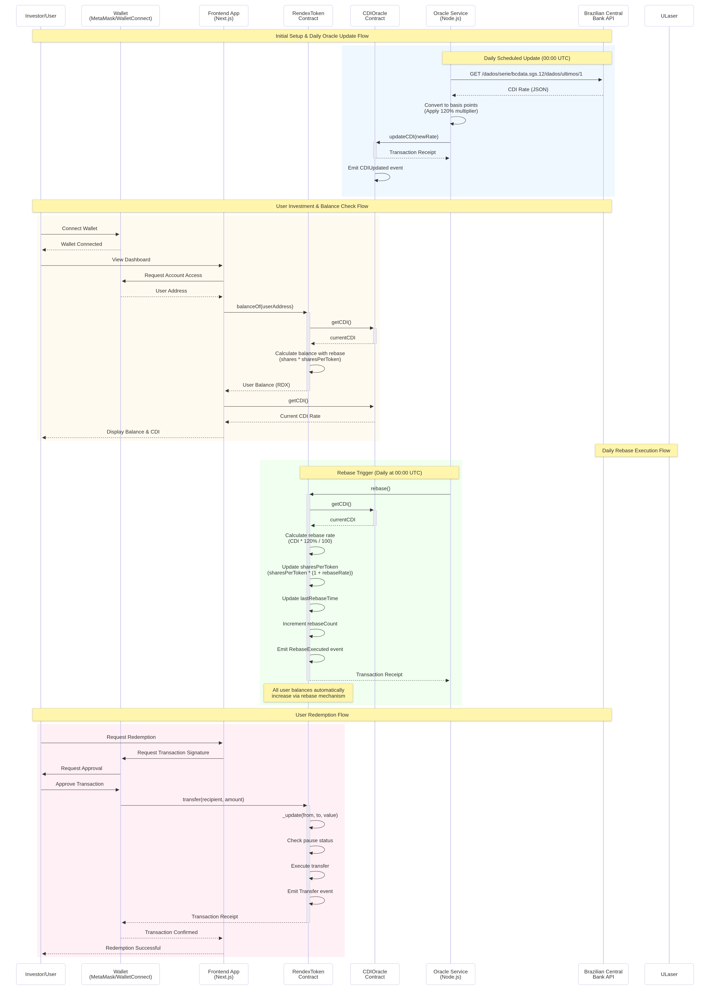
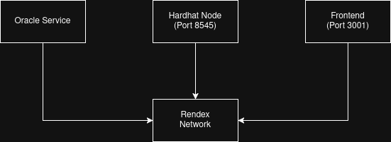

# Rendex

## Introduction

This project serves as the final submission for the "EVM Chain Certification" progoram offered by Alchemy University. The investment use case presented herein was selected as the Capstone Project due to its foundational simplicity, which provides a clear and accessible framework for demonstrating core blockchain development principles. However, the implementation introduces several nuanced complexities, particularly in the integration of an off-chain oracle mechanism that bridges traditional financial data sources with on-chain smart contract execution. The comprehensive investment lifecycle—encompassing tokenization, yield accrual through rebasing mechanisms, and redemption processes offers a holistic opportunity to synthesize and apply the diverse technical competencies acquired throughout the certification curriculum.

## Project Description

<p align="center">
  
</p>


<b>Rendex</b> is a simple Web3 simulation of an investment flow using a rebasing ERC-20 token (RDX). It mimics how users earn yield on invested funds, with returns based on a post-fixed rate tied to <b>CDI</b>, a Brazilian benchmark interest rate used in fixed-income financial products. The token balance grows daily through smart contract-controlled rebases, using an oracle-fed CDI value to simulate on-chain yield.


> ⚖️ **Regulatory Notice**
>
> The modeled asset in this project I understand behaves economically as an investment product and would likely be characterized as a **security** under Brazilian regulation.  
> In a real market implementation, a yield-bearing tokenized deposit would not function as a stablecoin, but rather as a financial investment whose return is tied to the performance of underlying assets.  
> As such, it would be subject to Brazilian taxes applicable to investments, including **Imposto de Renda (IR)** and **IOF**, depending on the final structure adopted (assuming that it is being launched in Brazil).


## Investment Journey Overview

This section provides a simplified, high-level view of how an investment moves from fiat deposit to on-chain value creation and final redemption.

<table>
<tr>
<td></td>
<td><strong>Depositing fiat</strong><br>The investor begins by depositing fiat currency into the platform. This deposit is held by the financial institution or on/off-ramp partner before entering the tokenization flow.</td>
</tr>
<tr>
<td></td>
<td><strong>Obtaining tokenized deposit</strong><br>The fiat deposit is converted into a digital representation known as a tokenized deposit. This on-chain token reflects the investor's claim to the underlying real-world funds.</td>
</tr>
<tr>
<td></td>
<td><strong>Investment pool</strong><br>The investor's tokenized deposit is transferred into the investment pool smart contract. In exchange, the investor receives pool tokens representing their proportional share of the pool.</td>
</tr>
<tr>
<td></td>
<td><strong>Pool value increases</strong><br>As the underlying assets generate yield, the pool's unit price increases over time. The oracle feeds updated pricing and performance data to the smart contract, ensuring accurate valuation.</td>
</tr>
<tr>
<td></td>
<td><strong>Redeeming token</strong><br>The investor converts their tokenized deposit back into fiat currency through the off-ramp partner. Finally, the funds are transferred back to the investor's traditional bank account.</td>
</tr>
</table>

---

> **Note:** In a real-world implementation, the investor would begin by depositing fiat, which is then converted into a tokenized deposit by a licensed financial institution.  
> This project does **not** cover the fiat-to-token (on-ramp) conversion process and starts from the point where the ERC-20 tokenized deposit already exists on-chain.

---

## 🔍 Overview

- **Token Type:** Rebasing ERC-20
- **Yield Rate:** 120% of CDI (daily rebase, compounded from monthly CDI)
- **Custody:** Off-chain (abstracted in the simulation)
- **Chain:** Sepolia (testnet)
- **Purpose:** Educational / Proof-of-Concept

---

## 💻 Tech Stack

| Layer           | Technology                  | Purpose                            |
|----------------|------------------------------|------------------------------------|
| Framework       | Next.js (TypeScript)         | Routing + SSR + scalability        |
| Wallet Connect  | RainbowKit + Wagmi           | MetaMask and WalletConnect support |
| Blockchain SDK  | Alchemy SDK                   | Contract calls + enhanced features |
| Styling         | Tailwind CSS                 | Fast UI development                |
| Provider        | Alchemy                      | RPC + observability + testnet/mainnet |
| Chain           | Sepolia                      | Testnet for MVP                    |

---

## 🧱 Architecture

### Smart Contracts

- `RendexToken`: ERC-20 token with `rebase()` function and CDI oracle integration
- `CDIOracle`: Oracle contract for CDI rate data

### Off-Chain Components

- **CDI Oracle Service**: A Node.js service that fetches the current CDI from the [Brazilian Central Bank API](https://api.bcb.gov.br/dados/serie/bcdata.sgs.12/dados/ultimos/1?formato=json) and updates the on-chain oracle once per day. The monthly CDI rate is converted to a daily compound rate using the formula: `daily_rate = (1 + monthly_cdi)^(1/30) - 1`.
- **Rebaser**: A cronjob or script that calls `updateCDI()` and triggers `rebase()` daily to maintain the yield simulation.

### Diagrams

#### Class Diagram

The following class diagram illustrates the architecture of the Rendex smart contracts, showing the relationship between `RendexToken`, `CDIOracle`, and the `ICDIOracle` interface:


For a detailed view and Mermaid source code, see [docs/UML-Class-Diagram.md](docs/UML-Class-Diagram.md).

#### Sequence Diagram

The following sequence diagram illustrates the complete system flow, including oracle updates, user interactions, rebase execution, and redemption processes:



For detailed Mermaid sequence diagrams with multiple views, see [docs/sequence-diagram.md](docs/sequence-diagram.md).

---

## 🧪 MVP Features

- ✅ Connect wallet using MetaMask or WalletConnect
- ✅ View current token balance (auto-increasing via rebase)
- ✅ Admin-only button to trigger `rebase()`
- ✅ Display the current CDI rate from the on-chain oracle

---

## 📂 Folder Structure

```
Rendex/
├── artifacts/        # Compiled contracts (generated)
├── cache/            # Hardhat cache (generated)
├── contracts/        # Smart contracts source code
├── docs/             # Project documentation (diagrams, UML, etc.)
├── images/           # Images and diagrams used in documentation
├── node_modules/     # NPM dependencies (generated)
├── oracle-service/   # Off-chain oracle service (Node.js / Lambda)
├── scripts/          # Deployment and utility scripts
├── test/             # Smart contract tests
└── typechain-types/  # Generated TypeScript types
```

---

## 🚀 Getting Started

### Option 1: Docker (Recommended)

1. Clone the repo
2. Start development environment:

```bash
# Using Makefile (recommended)
make up-dev

# Or using Docker Compose directly
docker-compose up -d frontend-dev
```

3. Access the application at http://localhost:3001

4. View logs:
```bash
make logs-frontend-dev
```

### Option 2: Local Development

1. Clone the repo
2. Install dependencies:

```bash
npm install
```

3. Add your Alchemy key to `.env.local`

4. Run the dev server:

```bash
npm run dev
```

### Docker Commands

```bash
# Show all available Docker commands
make help

# Development
make up-dev         # Start development environment
make build-dev      # Build development image
make logs-frontend-dev  # View logs

# Oracle Service
make up-oracle      # Start oracle service only
make oracle-logs    # View oracle service logs
make oracle-manual  # Trigger manual CDI update
make oracle-status  # Check oracle service status

# Production
make build          # Build production image
make up             # Start production environment
make deploy-prod    # Deploy to production

# Maintenance
make down           # Stop all services
make clean          # Clean up containers and images
```

### Docker Files Overview

| File | Purpose |
|------|---------|
| `Dockerfile` | Production-optimized multi-stage build |
| `Dockerfile.dev` | Development environment with hot reloading |
| `docker-compose.yml` | Main orchestration file |
| `docker-compose.override.yml` | Development-specific overrides |
| `.dockerignore` | Files excluded from Docker build context |
| `Makefile` | Convenient commands for common operations |

### Docker Configuration

#### Environment Variables

Create a `.env` file in the project root:

```env
# Database (if using PostgreSQL)
POSTGRES_DB=rendex
POSTGRES_USER=rendex_user
POSTGRES_PASSWORD=your_secure_password

# Redis (if using Redis)
REDIS_PASSWORD=your_redis_password

# Blockchain
PRIVATE_KEY=your_private_key_for_deployment
ETHERSCAN_API_KEY=your_etherscan_api_key
```

### Docker Architecture

#### Development Environment



### Docker Troubleshooting

1. **Port already in use:**
   ```bash
   # Check what's using the port
   lsof -i :3000
   
   # Stop conflicting services
   docker-compose down
   ```

2. **Permission issues:**
   ```bash
   # Fix file permissions
   sudo chown -R $USER:$USER .
   ```

3. **Build cache issues:**
   ```bash
   # Clean build cache
   docker-compose build --no-cache
   ```

4. **Container won't start:**
   ```bash
   # Check logs
   docker-compose logs frontend-dev
   
   # Check container status
   docker-compose ps
   ```

### Oracle Service Setup

The CDI Oracle Service is included in the Docker setup and will automatically start with the development environment. To configure it:

1. **Set environment variables** in your `.env` file:
```bash
RPC_URL=https://sepolia.infura.io/v3/YOUR_INFURA_KEY
ORACLE_PRIVATE_KEY=your_private_key_here
CDI_ORACLE_ADDRESS=0x... # Address of deployed CDI Oracle contract
```

2. **Start the oracle service**:
```bash
make up-oracle
```

3. **Monitor the service**:
```bash
make oracle-logs
```

For detailed oracle service documentation, see [oracle-service/README.md](oracle-service/README.md).

---

## 🧪 Testing

```bash
# Run contract tests
npm run test

# Run frontend tests
npm run test:frontend
```

---

## 🚀 Deployment

### Prerequisites

1. **Infura Account**: Get a free Infura API key from https://infura.io/
2. **MetaMask Wallet**: Create a new wallet and get the private key
3. **Sepolia ETH**: Get testnet ETH from a faucet (https://sepoliafaucet.com/)
4. **Etherscan API Key**: Get from https://etherscan.io/apis (optional, for verification)

### Step 1: Configure Environment

1. Edit the `.env` file in the project root:
   ```bash
   # Replace YOUR_PROJECT_ID with your Infura project ID
   RPC_URL=https://sepolia.infura.io/v3/YOUR_PROJECT_ID
   
   # Replace with your MetaMask private key (without 0x prefix)
   PRIVATE_KEY=your_private_key_here
   
   # Optional: For contract verification
   ETHERSCAN_API_KEY=your_etherscan_api_key_here
   ```

2. Make sure you have Sepolia ETH in your wallet for gas fees.

### Step 2: Deploy Contracts

Run the deployment script:

```bash
npm run deploy:sepolia
```

The script will:
- Deploy CDIOracle contract
- Deploy RendexToken contract
- Set up oracle permissions
- **Automatically save contract addresses to .env**

After deployment, your `.env` will be updated with:
- `CDI_ORACLE_ADDRESS=0x...`
- `RENDEX_TOKEN_ADDRESS=0x...`
- `DEPLOYER_ADDRESS=0x...`

### Step 3: Verify Contracts (Optional)

```bash
npx hardhat verify --network sepolia <CDI_ORACLE_ADDRESS> 1000 <DEPLOYER_ADDRESS>
npx hardhat verify --network sepolia <RENDEX_TOKEN_ADDRESS> "Rendex Token" "RDX" <CDI_ORACLE_ADDRESS> 1000000000000000000000000 <DEPLOYER_ADDRESS>
```

### Step 4: Configure Oracle Service

1. Copy the oracle service environment template:
   ```bash
   cp oracle-service/env.example oracle-service/.env
   ```

2. Edit `oracle-service/.env`:
   ```bash
   # Use the same RPC_URL from root .env
   RPC_URL=https://sepolia.infura.io/v3/YOUR_PROJECT_ID
   
   # Use a different wallet for the oracle (or same one)
   PRIVATE_KEY=oracle_wallet_private_key_here
   
   # Use the deployed CDI Oracle address
   CDI_ORACLE_ADDRESS=0x... # From Step 2
   ```

### Step 5: Deploy AWS Lambda

1. Make sure AWS CLI is configured:
   ```bash
   aws configure
   ```

2. Navigate to oracle-service directory:
   ```bash
   cd oracle-service
   ```

3. Set environment variables and deploy:
   ```bash
   export RPC_URL="https://sepolia.infura.io/v3/YOUR_PROJECT_ID"
   export PRIVATE_KEY="oracle_wallet_private_key"
   export CDI_ORACLE_ADDRESS="0x..." # From deployment
   
   ./deploy-lambda.sh
   ```

The Lambda will be scheduled to run daily at midnight UTC.

### Step 6: Test Oracle

Test the Lambda function manually:
```bash
aws lambda invoke --function-name rendex-oracle-update-cdi-prod --payload '{}' response.json
cat response.json
```

Or test locally:
```bash
cd oracle-service
npm run manual
```

### Troubleshooting

- **Insufficient funds**: Make sure your wallet has Sepolia ETH
- **RPC errors**: Verify your Infura key is correct
- **Deployment fails**: Check network connectivity and gas prices
- **Lambda errors**: Check CloudWatch logs in AWS Console

---

## 🔧 API Integration

The CDI rate is fetched from the Brazilian Central Bank API:

- **Latest Rate:** `https://api.bcb.gov.br/dados/serie/bcdata.sgs.12/dados/ultimos/1?formato=json`
- **Historical Data:** `https://api.bcb.gov.br/dados/serie/bcdata.sgs.12/dados?formato=json&dataInicial=DD/MM/AAAA&dataFinal=DD/MM/AAAA`

The monthly CDI rate is converted to daily compound rate: `daily_rate = (1 + monthly_cdi)^(1/30) - 1`

---

## 👨‍💼 Admin Functions

- `updateCDI(uint256 newRate)`: Update the CDI rate (admin only)
- `rebase()`: Trigger daily rebase (admin only)
- `setAdmin(address newAdmin)`: Transfer admin role (admin only)

---

## 📋 Smart Contracts

### Architecture Overview

```
┌─────────────────┐    ┌─────────────────┐
│   CDIOracle     │    │  RendexToken    │
│                 │    │                 │
│ • Stores CDI    │◄───┤ • Rebasing      │
│ • Updates rates │    │ • Yield sim     │
│ • Validates     │    │ • ERC-20        │
└─────────────────┘    └─────────────────┘
```

### RendexToken Contract

**Purpose**: Main rebasing ERC-20 token that simulates yield based on CDI rates.

**Key Features**:
- ✅ **Daily rebases** based on CDI rate (120% of CDI)
- ✅ **Oracle integration** for real-time CDI data
- ✅ **Share-based rebasing** for accurate yield simulation
- ✅ **Pausable** for emergency situations
- ✅ **Admin controls** for oracle updates

**Core Functions**:
```solidity
// Execute daily rebase
function rebase() external onlyRebaser rebaseReady

// Get current CDI rate
function getCurrentCDI() public view returns (uint256)

// Calculate rebase rate (120% of CDI)
function calculateRebaseRate() public view returns (uint256)

// Get rebase statistics
function getRebaseStats() external view returns (...)
```

**Rebase Mechanism**:
1. **Daily Interval**: Rebase can only be executed once per day
2. **CDI Rate**: Fetched from oracle (e.g., 10% = 1000 basis points)
3. **Rebase Rate**: 120% of CDI (e.g., 12% for 10% CDI)
4. **Share Calculation**: `new_shares = old_shares * (1 + rebase_rate)`

### CDIOracle Contract

**Purpose**: Oracle contract that stores and provides CDI rate data.

**Key Features**:
- ✅ **Rate validation** (0-50% range)
- ✅ **Authorized updaters** system
- ✅ **Staleness detection** (7-day threshold)
- ✅ **Emergency updates** for stale rates
- ✅ **Health monitoring**

**Core Functions**:
```solidity
// Update CDI rate
function updateCDI(uint256 _newCDI) external onlyAuthorizedUpdater

// Get current CDI with metadata
function getCDIWithMetadata() external view returns (...)

// Check oracle health
function isHealthy() external view returns (bool)

// Emergency update for stale rates
function emergencyUpdateCDI(uint256 _newCDI) external onlyOwner
```

### Configuration

**CDI Rate System**:
- **Basis Points**: 1000 = 10%, 1500 = 15%, etc.
- **Range**: 0-5000 basis points (0-50%)
- **Update Frequency**: Daily (configurable)
- **Staleness Threshold**: 7 days

**Rebase Parameters**:
- **Interval**: 24 hours (1 day)
- **Multiplier**: 120% of CDI rate
- **Example**: 10% CDI → 12% daily rebase

**Token Parameters**:
- **Name**: "Rendex Token"
- **Symbol**: "RDX"
- **Initial Supply**: 1,000,000 tokens
- **Decimals**: 18

### Yield Simulation

**How It Works**:
1. **CDI Rate**: Brazilian benchmark interest rate (e.g., 10%)
2. **Daily Rebase**: Token balances increase daily
3. **Compounding**: Previous day's gains are included in next rebase
4. **Simulation**: No real yield, just token balance increases

**Example Calculation**:
```
Initial Balance: 1000 RDX
CDI Rate: 10% (1000 basis points)
Rebase Rate: 12% (120% of CDI)

Day 1: 1000 * (1 + 0.12) = 1120 RDX
Day 2: 1120 * (1 + 0.12) = 1254.4 RDX
Day 30: ~34,000 RDX (compounded daily)
```

### Security Features

**Access Control**:
- **Owner-only functions**: Oracle updates, pausing
- **Authorized updaters**: CDI rate updates
- **Rebaser permissions**: Daily rebase execution

**Safety Mechanisms**:
- **Rate validation**: CDI rates within safe bounds
- **Staleness detection**: Automatic detection of old rates
- **Emergency pause**: Ability to pause all operations
- **Reentrancy protection**: Guards against reentrancy attacks

---

## 📜 License

MIT (for code), simulation only — no real funds involved.
