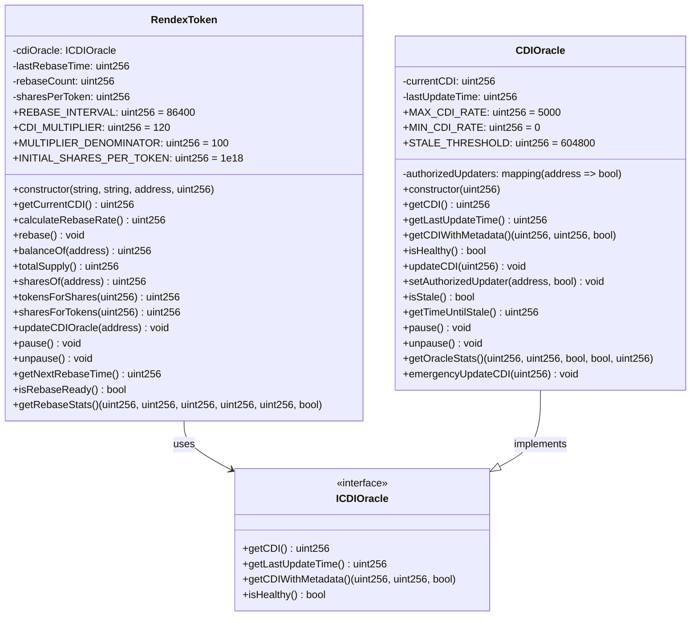
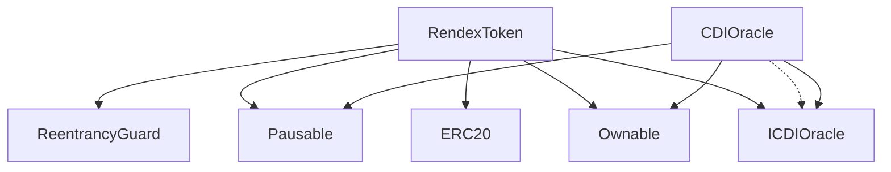
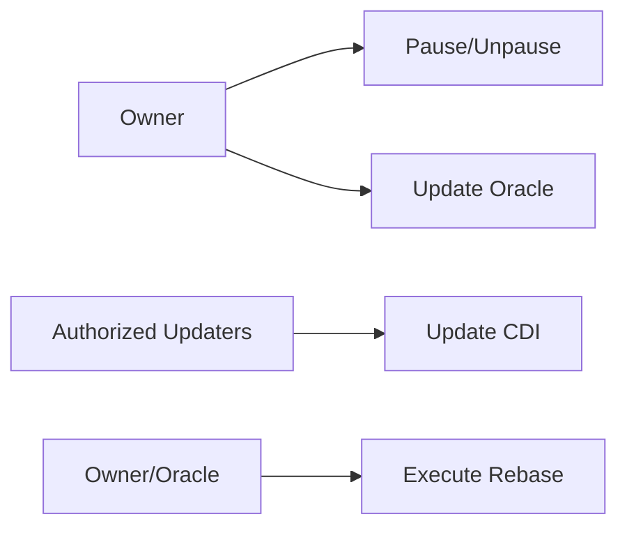
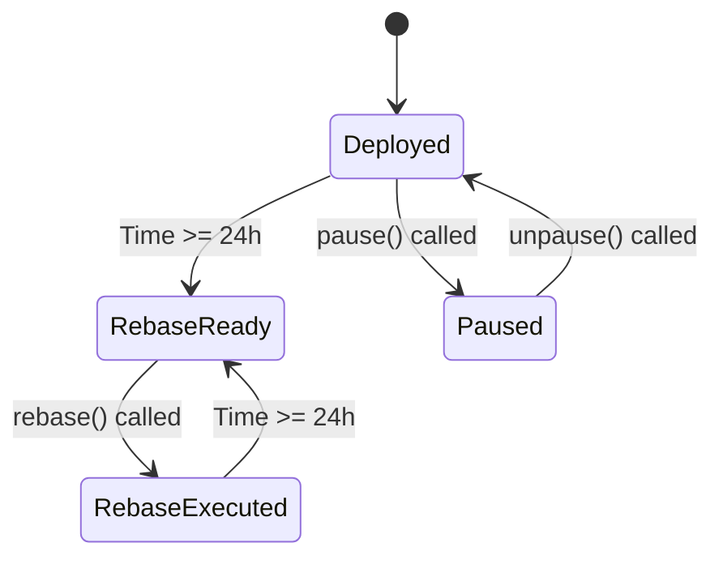
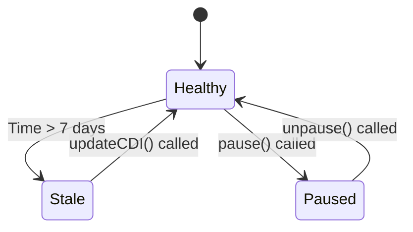

# UML Class Diagram - Rendex Smart Contracts

## 🏗️ Simplified Class Diagram

**Note**: Both contracts include standard security features (access control, pausing, reentrancy protection) but are not shown in the diagram for clarity.

## 📋 Detailed Class Descriptions

### **RendexToken Class**

**Core Functionality:**
- Rebasing ERC-20 token with CDI-based yield simulation
- Daily rebases at 120% of CDI rate
- Share-based balance calculation
- Emergency pause functionality

**Key Properties:**
- `cdiOracle`: Reference to CDI oracle contract
- `lastRebaseTime`: Timestamp of last rebase
- `rebaseCount`: Number of rebases executed
- `sharesPerToken`: Current shares per token ratio
- `REBASE_INTERVAL`: 24 hours (86400 seconds)
- `CDI_MULTIPLIER`: 120% of CDI rate
- `INITIAL_SHARES_PER_TOKEN`: 1e18 (initial ratio)

**Core Methods:**
- `rebase()`: Execute daily rebase (admin/oracle only)
- `getCurrentCDI()`: Fetch current CDI from oracle
- `calculateRebaseRate()`: Calculate 120% of CDI
- `balanceOf()`: Override to account for rebasing
- `totalSupply()`: Override to account for rebasing

### **CDIOracle Class**

**Core Functionality:**
- Oracle contract for CDI rate data
- Rate validation and staleness detection
- Authorized updater system
- Emergency update capabilities

**Key Properties:**
- `currentCDI`: Current CDI rate in basis points
- `lastUpdateTime`: Timestamp of last update
- `authorizedUpdaters`: Mapping of authorized updaters
- `MAX_CDI_RATE`: 5000 (50% maximum)
- `MIN_CDI_RATE`: 0 (0% minimum)
- `STALE_THRESHOLD`: 7 days (604800 seconds)

**Core Methods:**
- `updateCDI()`: Update CDI rate (authorized only)
- `getCDI()`: Return current CDI rate
- `isStale()`: Check if rate is stale
- `isHealthy()`: Check oracle health
- `emergencyUpdateCDI()`: Emergency update for stale rates

### **ICDIOracle Interface**

**Required Methods:**
- `getCDI()`: Return current CDI rate
- `getLastUpdateTime()`: Return last update timestamp
- `getCDIWithMetadata()`: Return rate with metadata
- `isHealthy()`: Return oracle health status

## 🔄 Relationships and Dependencies

### **Association Relationships**

### **Dependency Flow**

1. **RendexToken** depends on **ICDIOracle** for CDI rates
2. **CDIOracle** implements **ICDIOracle** interface
3. **RendexToken** can call **CDIOracle** methods through interface
4. Both contracts include standard security features (access control, pausing, reentrancy protection)

## 🎯 Key Design Patterns

### **1. Interface Segregation**
- `ICDIOracle` provides clean interface for CDI data
- Allows for different oracle implementations
- Enables easy testing with mock oracles

### **2. Contract Composition**
- Clean separation of concerns
- Interface-based design for oracle integration
- Standard security patterns (access control, pausing, reentrancy protection)
- Modular architecture for easy testing and upgrades

### **3. Dependency Injection**
- Oracle address injected via constructor
- Allows for oracle upgrades
- Enables testing with different oracles

## 🔒 Security Considerations

### **Access Control**

### **Reentrancy Protection**
- `ReentrancyGuard` prevents reentrancy attacks
- Applied to `rebase()` function
- Critical for financial operations

### **Input Validation**
- CDI rate bounds checking (0-50%)
- Oracle address validation
- Timestamp validation for rebases

## 📊 State Management

### **RendexToken State**

### **CDIOracle State**

## 🧪 Testing Strategy

### **Unit Tests**
- Test each contract in isolation
- Mock dependencies (oracle interface)
- Test all public and external functions

### **Integration Tests**
- Test contract interactions
- Test complete rebase flow
- Test oracle updates and token reactions

### **Security Tests**
- Test access control
- Test reentrancy protection
- Test edge cases and bounds

## 📈 Gas Optimization

### **Storage Optimization**
- Packed structs where possible
- Efficient data types
- Minimal storage variables

### **Function Optimization**
- View functions for read operations
- Batch operations where possible
- Efficient loops and calculations

This UML diagram provides a complete view of the smart contract architecture, showing all relationships, methods, and design patterns used in the Rendex protocol. 